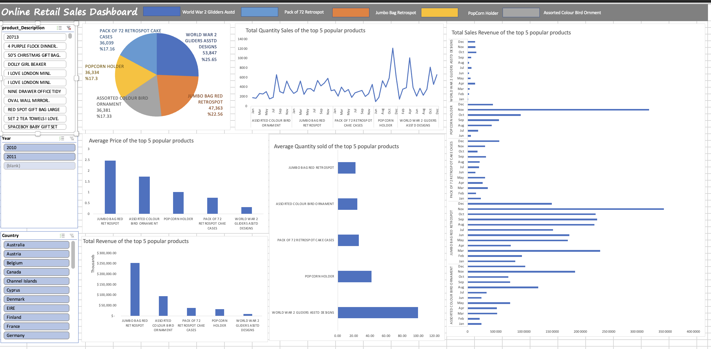

# online-retail-analysis

## Data Set information:

This online Retail II data set contains all the transactions occurring for a UK-based and registered, non store online retail between 1/12/2009 and 09/12/2011. The company mainly sells unique all-occasion gift-wave. Many customers of the company are wholesalers.

## Online Retail Analysis Dashboard

In this project, I use Microsoft Excel for analytics and visualization purposes. The dataset I am working with is from the University of Irvine Machine Learning Repository. Additionally, you can access a multitude of datasets from this particular UCI repository.

## Recommendation:

Based on the analysis, the top selling products are 
1. Jumbo Bag Red Retrospot
2. Assorted Color Bird Ornament
3. Pack of 72 Retrospot Cake Cases
4. Pop Corn Holder
5. World War 2 Gliders Asstd Designs.

I recommend that this company focus on these products and ensure that they are always in stock to meet customer demand.

Action Steps:

1. Consider offering discounts or promotions for the top-selling products to encourage customers to purchase more.

2. Monitor the sales of these products on a monthly basis to identify any changes in demand.